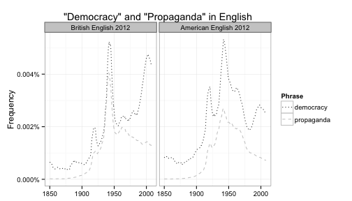
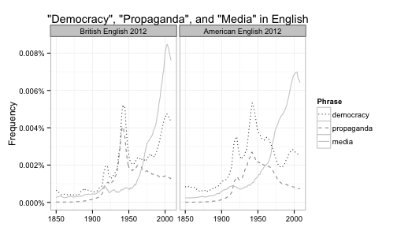
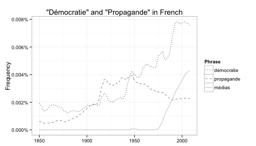

#### Propaganda and the ideology of democracy

The notion of "democracy" as an internationally recognized and supposedly desirable feature of national political systems is relatively new. It is only around the time of World War I that "democracy" makes its debut as a recognizable ideology of national governments. More specifically, it was ony a relatively small group of Allied elites who launched this term into mass political consciousness in order to create public support for war against Germany.

The graphs below use data from Google Books to show that World War I is associated with a noticeable spike of public interest in "democracy" and that up until recently "democracy" co-varied with "propaganda." The data is from [Google Ngrams](https://books.google.com/ngrams), which basically counts the occurrence of phrases from millions of books in multiple languages.

 

Media as a concept appears to replace the more sinister notion of propaganda.

 

A similar pattern in French but with notable differences.

 

